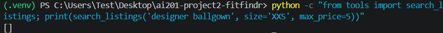
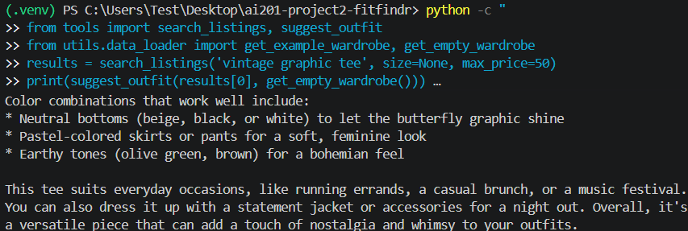
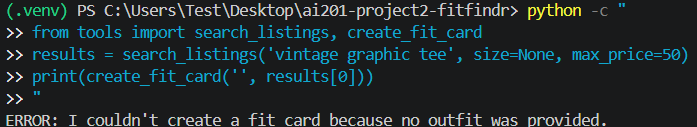

# FitFindr — Starter Kit

This starter kit contains everything you need to begin Project 2.

## What's Included

```
ai201-project2-fitfindr-starter/
├── data/
│   ├── listings.json          # 40 mock secondhand listings
│   └── wardrobe_schema.json   # Wardrobe format + example wardrobe
├── utils/
│   └── data_loader.py         # Helper functions for loading the data
├── planning.md                # Your planning template — fill this out first
└── requirements.txt           # Python dependencies
```

## Setup

```bash
pip install -r requirements.txt
```

Set your Groq API key in a `.env` file (get a free key at [console.groq.com](https://console.groq.com)):
```
GROQ_API_KEY=your_key_here
```

## The Mock Listings Dataset

`data/listings.json` contains 40 mock secondhand listings across categories (tops, bottoms, outerwear, shoes, accessories) and styles (vintage, y2k, grunge, cottagecore, streetwear, and more).

Each listing has: `id`, `title`, `description`, `category`, `style_tags`, `size`, `condition`, `price`, `colors`, `brand`, and `platform`.

Load it with:
```python
from utils.data_loader import load_listings
listings = load_listings()
```

## The Wardrobe Schema

`data/wardrobe_schema.json` defines the format your agent uses to represent a user's existing wardrobe. It includes:

- `schema`: field definitions for a wardrobe item
- `example_wardrobe`: a sample wardrobe with 10 items you can use for testing
- `empty_wardrobe`: a starting template for a new user

Load an example wardrobe with:
```python
from utils.data_loader import get_example_wardrobe
wardrobe = get_example_wardrobe()
```

## Where to Start

1. **Read `planning.md` and fill it out before writing any code.**
2. Verify the data loads correctly by running `python utils/data_loader.py`.
3. Build and test each tool individually before connecting them through your planning loop.

Your implementation files go in this same directory. There's no required file structure for your agent code — organize it however makes sense for your design.

## Tools

### Tool 1: search_listings

**What it does:**
<!-- Describe what this tool does in 1–2 sentences -->
- This tool will allow the agent to search the available listings of clothing items and filter for specific items based on the inputted description, size, and price.

**Input parameters:**
<!-- List each parameter, its type, and what it represents -->
- `description` (str): keywords that relate to what items the user wants to look for
- `size` (str or None): an optional size filter such as S/M/L/XL or a numeric shoe size
- `max_price` (float or None): an optional maximum price filter

**What it returns:**
<!-- Describe the return value — what fields does a result contain? -->
- The tool will return a list of item listings that match the filters ranked by relevancy. Each item listing is represented as a dictionary with information/metadata relating to the listing (as shown in the listings.json).

**What happens if it fails or returns nothing:**
<!-- What should the agent do if no listings match? -->
- The tool returns an empty list when no listings match or when an unexpected search/data-loading error occurs. The agent treats an empty list as no results, sets a helpful error in the session, and returns early without calling `suggest_outfit()` or `create_fit_card()`.
---

### Tool 2: suggest_outfit

**What it does:**
<!-- Describe what this tool does in 1–2 sentences -->
- This tool will curate and suggest an outfit for the user using a specific clothing item listing with the rest of the user's wardrobe.

**Input parameters:**
<!-- List each parameter, its type, and what it represents -->
- `new_item` (dict): a specific clothing item listing that the user doesn't own yet
- `wardrobe` (dict): all of the clothing items (associated to the "items" key) that the user has in their wardrobe to match/style with the new item

**What it returns:**
<!-- Describe the return value -->
- The tool will return a string describing an outfit that uses the specified new clothing item and the user's wardrobe. If the wardrobe is empty, the tool will return styling tips for the new item instead of outfits.

**What happens if it fails or returns nothing:**
<!-- What should the agent do for an empty wardrobe or an outfit-generation failure? -->
- An empty wardrobe is handled as a valid case, so the tool asks the LLM for general styling advice for the selected item. If the item is missing, the LLM/API fails, or the model returns no usable text, the tool returns a descriptive error string. The agent detects that result, sets `session["error"]`, and returns early.
---

### Tool 3: create_fit_card

**What it does:**
<!-- Describe what this tool does in 1–2 sentences -->
- The tool will create a short caption describing the provided outfit string, which will mention the clothing items used and highlights the selected item that was searched for.

**Input parameters:**
<!-- List each parameter, its type, and what it represents -->
- `outfit` (str): a string to describe the outfit, containing the clothing items to style the outfit
- `new_item` (dict): a dictionary containing the information/metadata of a clothing item listing that the outfit is styled around

**What it returns:**
<!-- Describe the return value -->
- The tool returns a short, shareable caption that describes the outfit and highlights the selected item, including its price and platform.

**What happens if it fails or returns nothing:**
<!-- What should the agent do if the outfit data is incomplete? -->
- If the outfit or selected item is missing, the LLM/API fails, or the model returns an empty string, the tool returns a descriptive error string instead of raising an exception. The agent detects that result, sets `session["error"]`, and returns without setting `session["fit_card"]`.

---

## Planning Loop

- The agent first checks that the user query is not blank. It then uses an LLM to parse the query into a dictionary containing the item description, optional size, and optional maximum price to set in the session state. If parsing fails or produces invalid data, the agent sets `session["error"]` and returns early.
- For every successfully parsed query, the agent attempts to call the tools in this fixed order: `search_listings()` -> `suggest_outfit()` -> `create_fit_card()`. Each tool is called only if the previous stage succeeded.
- The agent calls `search_listings()` with the parsed description, size, and maximum price, then stores the returned list in `session["search_results"]`.
     - If the list is empty, the agent sets an error message in `session["error"]` and returns without calling the remaining tools.
     - If results are available, the agent selects the first and highest-ranked listing and stores it in `session["selected_item"]`.
- The agent calls `suggest_outfit()` with `session["selected_item"]` and `session["wardrobe"]`.
     - If the wardrobe is empty, the tool returns general styling advice.
     - If the tool returns an empty value or an error string, the agent sets an outfit error in `session["error"]` and returns without calling `create_fit_card()`.
     - Else, the agent stores the returned string in `session["outfit_suggestion"]`.
- The agent calls `create_fit_card()` with `session["outfit_suggestion"]` and `session["selected_item"]`.
     - If the tool returns an empty value or an error string, the agent sets a fit-card error in `session["error"]` and returns.
     - Else, the agent stores the caption in `session["fit_card"]`.
- The agent returns the session after a successful fit-card creation or immediately after any error. The implementation does not retry or recall a failed tool call.

## State Management

**How does information from one tool get passed to the next?**

The session state will update/save information after each call as there is an order of how the tools should be called.
- `query` (string of user query)
     - Loaded in already on session creation. 
- `parsed` (dictionary with parsed information in query)
     - Starts empty
     - Set to the result of a LLM-powered parsing helper function at beginning of agent's planning loop if parsing was successful
     - Accessed for `search_listings()` to filter listings
- `wardrobe` (dictionary with a list of items associated to the key "items")
     - Loaded in already on session creation
     - Accessed for `suggest_outfit()`
- `search_results` (list of dictionaries of item listing information)
     - Starts empty
     - Set to result of `search_listings()` if tool call was successful
- `selected_item` (dictionary with the item listing information)
     - Starts empty
     - Set to top/first item in result of `search_listings()` if tool call was successful
     - Accessed for `suggest_outfit()` and `create_fit_card()`
- `outfit_suggestion` (string describing the outfit)
     - Starts empty
     - Set to result of `suggest_outfit()` if tool call was successful
     - Accessed for `create_fit_card()`
- `fit_card` (string representing caption that describes outfit and selected item)
     - Starts empty
     - Set to result of `create_fit_card()` if tool call was successful
- `error` (string describing error in loop)
     - Starts empty
     - Will be set whenever there's an error in parsing or calling tools in the loop

---

## Error Handling
| Tool | Failure mode | Agent response |
|------|-------------|----------------|
| search_listings | No results match the query | Say it couldn't find any match and suggest another search. |
| suggest_outfit | Wardrobe is empty | Suggest styling advice for the item instead of outfits. |
| create_fit_card | Outfit input is missing or incomplete | Say there isn't an outfit to make a caption for yet. Ask to style an outfit first or have them describe it. |

- `search_listings` with no result match -> empty list:
    - 
    - 
- `suggest_outfit` with an empty wardrobe -> suggest styling advice:
    - 
- `create_fit_card` with missing outfit input -> descriptive error message:
    - 
## Spec Reflection

- **One way the spec helped you during implementation:**
  - The `planning.md` spec really helped me in organizing and planning how the agent planning loop should run and account for errors. Figuring out beforehand what each tool should do (specifically input and output) and planning how the agent should utilize them made understanding the connections of tools and implementation much easier.   
- **One way your implementation diverged from the spec, and why:**
  - One key divergence from my planned specs was adding retries on errors with tool calls. Initially, I wanted to have the agent verify it made the right tool call before it decides the result wasn't valid. If not, it would try to retry the tool call in attempt to get a valid result to then continue with the planning loop flow. I diverged from this because I think it would have added more complexity and I wanted to simplify the project to be easier to understand and grasp the concepts first before thinking of stretch features.
---

## AI Usage

**Instance 1**

- *What I gave the AI:*
    - `planning.md`
        - Architecture Diagram
        - Session 
        - Tools section (Tool 1)
    - `listings.json` and `data_loader.py` to know data schemas
    - `tools.py`: `search_listings()` function stub and docstring
- *What it produced:*
    - It produced the `search_listings()` function which took in a description, size, and max_price inputs to filter and return relevant item listings. If there was an empty or keyword-less description passed in, it would return a list of relevant items based on the size and price as a fallback.
- *What I changed or overrode:*
    - I didn't like that fallback idea it provided, so I overrode and redirected it to prioritize the description over the other two details so that it would only pick items most relevant to the description or return an empty list if none could be found.

**Instance 2**

- *What I gave the AI:*
    - `planning.md`
        - Planning Loop (tool ordering, to know about parsing before `search_listings()` tool call)
        - State Management (description of the `query` and `parsed` in the state)
        - Architecture Diagram
    - `agent.py`: `run_agent()` function stub and docstring which described state management
    - Instructions to create a helper function that parses the query for data to properly make a tool call with `search_listings()`.
- *What it produced:*
    - It produced `_parse_query()` which parses the query using regex to extract the description, size, and max price. It returned a dictionary (to match the `parsed` dictionary and `search_listings` parameters). If a query was long, all of the query (except for the extracted size and max price) would be considered the "description", rather than keywords to match with when filtering for listings.
- *What I changed or overrode:*
    - I didn't like the idea of overloading the "description" with unnecessary words that may reduce accuracy on matching and I wanted to keep it to mainly keywords if possible. I then redirected it to use an LLM-powered query parser since it can be more flexible, which fits the case of a user message not being fully structured.