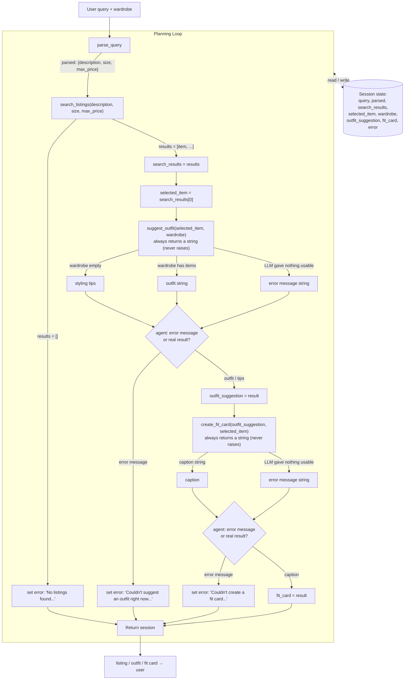

# FitFindr — planning.md

> Complete this document before writing any implementation code.
> Your spec and agent diagram are what you'll use to direct AI tools (Claude, Copilot, etc.) to generate your implementation — the more specific they are, the more useful the generated code will be.
> Your planning.md will be reviewed as part of your submission.
> Update it before starting any stretch features.

---

## Tools

List every tool your agent will use. For each tool, fill in all four fields.
You must have at least 3 tools. The three required tools are listed — add any additional tools below them.

### Tool 1: search_listings

**What it does:**
<!-- Describe what this tool does in 1–2 sentences -->
- This tool will allow the agent to search the available listings of clothing items and filter for specific items based on the inputted description, size, and price.

**Input parameters:**
<!-- List each parameter, its type, and what it represents -->
- `description` (str): keywords that relate to what items the user wants to look for
- `size` (str): a size to filter (like S/M/L/XL or "small") for relating to the item the user wants to search for
- `max_price` (float): the maximum price to filter for relating to the item the user wants to search for

**What it returns:**
<!-- Describe the return value — what fields does a result contain? -->
- The tool will return a list of item listings that match the filters ranked by relevancy. Each item listing is represented as a dictionary with information/metadata relating to the listing (as shown in the listings.json).

**What happens if it fails or returns nothing:**
<!-- What should the agent do if no listings match? -->
- If there was an error with the tool call, the agent should analyze the parameters it used with the tool and verify it used the correct parameters. It should retry the tool call if it needs to correct its parameters. If the parameters were correct and it returned an empty list of listings, then the agent will immediately stop the loop and tell the user that there were no listings that match the description they gave.
---

### Tool 2: suggest_outfit

**What it does:**
<!-- Describe what this tool does in 1–2 sentences -->
- This tool will curate and suggest an outfit for the user using a specific clothing item listing with the rest of the user's wardrobe.

**Input parameters:**
<!-- List each parameter, its type, and what it represents -->
- `new_item` (dict): a specific clothing item listing that the user doesn't own yet
- `wardrobe` (dict): all of the clothing items (associated to the "items" key) that the user has in their wardrobe to match/style with the new item

**What it returns:**
<!-- Describe the return value -->
- The tool will return a string describing an outfit that uses the specified new clothing item and the user's wardrobe. If the wardrobe is empty, the tool will return styling tips for the new item instead of outfits.

**What happens if it fails or returns nothing:**
<!-- What should the agent do if the wardrobe is empty or no outfit can be suggested? -->
-  If the wardrobe is empty or if no outfit can be suggested, the tool will return styling tips for the new item instead of outfits.
---

### Tool 3: create_fit_card

**What it does:**
<!-- Describe what this tool does in 1–2 sentences -->
- The tool will create a short caption describing the provided outfit string, which will mention the clothing items used and highlights the selected item that was searched for.

**Input parameters:**
<!-- List each parameter, its type, and what it represents -->
- `outfit` (str): a string to describe the outfit, containing the clothing items to style the outfit
- `new_item` (dict): a dictionary containing the information/metadata of a clothing item listing that the outfit is styled around

**What it returns:**
<!-- Describe the return value -->
- The tool returns a short caption that describes the outfit and highlights the new item the outfit was styled around. The caption is meant to be shareable and can be used for social media like Instagram/Tiktok. If the outfit data is missing/empty, it will just say that the information on the outfit is missing.

**What happens if it fails or returns nothing:**
<!-- What should the agent do if the outfit data is incomplete? -->
- If the outfit is missing or empty, the agent will not create a caption. It will need to check if it can call the tool again with an actual outfit string. If not, the agent should ask for a description of the outfit.

---

### Additional Tools (if any)

<!-- Copy the block above for any tools beyond the required three -->

---

## Planning Loop

**How does your agent decide which tool to call next?**
<!-- Describe the logic your planning loop uses. What does it look at? What conditions change its behavior? How does it know when it's done? -->

- Based on the user's message, the agent will decide which tools it needs to use.
     - The query is parsed by the LLM into a structured dictionary containing only
       the item description, optional size, and optional maximum price. This avoids
       relying on a fixed query format and excludes outfit or caption requests from
       the listing description.
     - Search for an item from a description? `search_listings()`
     - Create an outfit after finding an item? `search_listing()` -> `suggest_outfits()`
     - Make a caption of a created outfit after finding an item to share on social media? `search_listing()` -> `suggest_outfits()` -> `create_fit_card()`
- If asked to search for an item from a description, the agent will call `search_listings()`
     - Before: agent must check if information of what to search for was provided to call with the tool.
     - After: agent checks if the results were empty. If it was empty, it should verify it called the tool correctly and that the empty result is valid. If not, it will recall. If it called it correctly and had the empty result, it must set an error message in the session state and return early. If the were results, it will set the selected item as the first item in the returned results because that is the best ranked match to the user query.
- If asked to suggest/style outfits in the user query, it will then call `suggest_outfits()` after it called `search_listing()`.
     - Before: agent will check the session has a selected item.
     - After: agent will check if the result is empty or not. If the result was empty, it should verify it called the tool correctly and that the empty result is valid. It will recall if it called wrong initially, else it will set the error message for the session and return early. If there are results, it will set the outfit_suggestion in the session as the returned string.
- If asked to create short and shareable captions of the outfits in the user query, it will then call `create_fit_card()` after it called `suggest_outfits()`.
     - Before: agent will check the session has an outfit suggestions.
     - After: agent will check if the result is empty or not. If the result was empty, it should verify it called the tool correctly and that the empty result is valid. It will recall if it called wrong initially, else it will set the error message for the session and return early. If there are results, it will set the fit_card in the session as the returned string.
- The session will be returned at the end. 
---

## State Management

**How does information from one tool get passed to the next?**
<!-- Describe how your agent stores and accesses state within a session. What data is tracked? How is it passed between tool calls? -->
- The session state will have update information after each call as there is an order of how the tools should be called.
- `query` (string of user query)
     - Will be loaded in already on session creation. 
- `parsed` (dictionary with parsed information in query)
     - Will be accessed for `search_listings()` to filter listings
- `wardrobe` (dictionary with a list of items associated to the key "items")
     - Will be loaded in already on session creation; will be accessed for `suggest_outfit()`
- `search_results` (list of dictionaries of item listing information)
     - Will be set to result of `search_listings()`.
- `selected_item` (dictionary with the item listing information)
     - Will be set to top/first item in result of `search_listings()`, get's accessed for `suggest_outfit()` and `create_fit_card()`
- `outfit_suggestion` (string describing the outfit)
     - Will be set to result of `suggest_outfit()`, get's accessed for `create_fit_card()`
- `fit_card` (string representing caption that describes outfit and selected item)
     - Will be set to result of `create_fit_card()`.
- `error` (string describing error in loop)
     - Will be set whenever there's an error in calling tools in the loop

---

## Error Handling

For each tool, describe the specific failure mode you're handling and what the agent does in response.

| Tool | Failure mode | Agent response |
|------|-------------|----------------|
| search_listings | No results match the query | Say it couldn't find any match and suggest another search. |
| suggest_outfit | Wardrobe is empty | Suggest styling advice for the item instead of outfits. |
| create_fit_card | Outfit input is missing or incomplete | Say there isn't an outfit to make a caption for yet. Ask to style an outfit first or have them describe it. |

---

## Architecture

<!-- Draw a diagram of your agent showing how the components connect:
     User input → Planning Loop → Tools (search_listings, suggest_outfit, create_fit_card)
                                                                          ↕
                                                                   State / Session
     Show what triggers each tool, how state flows between them, and where error paths branch off.
     ASCII art, a Mermaid diagram (https://mermaid.js.org/syntax/flowchart.html), or an embedded
     sketch are all fine. You'll share this diagram with an AI tool when asking it to implement
     the planning loop and each individual tool. -->

---

## AI Tool Plan

<!-- For each part of the implementation below, describe:
     - Which AI tool you plan to use (Claude, Copilot, ChatGPT, etc.)
     - What you'll give it as input (which sections of this planning.md, your agent diagram)
     - What you expect it to produce
     - How you'll verify the output matches your spec before moving on

     "I'll use AI to help me code" is not a plan.
     "I'll give Claude my Tool 1 spec (inputs, return value, failure mode) and ask it to implement
     search_listings() using load_listings() from the data loader — then test it against 3 queries
     before trusting it" is a plan. -->

**Milestone 3 — Individual tool implementations:**
- `search_listings()`: 
     - I'll give Claude my planning.md, specifically the implementation details of the function in the Tools section, the listings.json to understand the listings schema, the docstring of the function in tools.py, and the architecture diagram to understand how the tool will be connected. I expect the function to filter the listings based on the inputted description, size, and maximum price and return a list of those listings ranked by relevance descendingly. If there are no matches or errors, it should return an empty list. Then I will test with three queries for clothing items and view the results it returns.
- `suggest_outfits()`: 
     - I'll give Claude my planning.md, specifically the implementation details of the function in the Tools section, the listings.json to understand the listing schema, the wardrobe_schema.json to understand the schema of a wardrobe, the docstring of the function in tools.py, and the architecture diagram to understand how the tool will be connected. The function needs to first check if the wardrobe is empty or not. If empty, it will give styling tips for the selected item listing rather than suggesting outfits using the wardrobe. If there is a wardrobe, the function format the wardrobe and item listing to prompt an LLM to style an outfit combination. The LLM's response will be returned. If no response was returned or an error, return a descriptive error string. Then I will test with three queries using the wardrobes and an item from the listings and view the results it returns.
- `create_fit_card()`:
     - I'll give Claude my planning.md, specifically the implementation details of the function in the Tools section, the listings.json to understand the listing schema, the docstring of the function in tools.py, and the architecture diagram to understand how the tool will be connected. The function should check that the outfit string is not empty, else it will return a descriptive error string instantly. If not, it will build a prompt with the item detail and also the suggested outfit, asking an LLM to create a short caption. The LLM's response will be returned. If no response was returned or an error, return a descriptive error string. Then I will test with three queries using strings describing an outfit and also an item listing and view the results it returns.

**Milestone 4 — Planning loop and state management:**
- Planning Loop & State Management:
     - I'll give Codex my planning.md, specifically the planning loop section to understand the flow and order of tool usage and saved state information, state management section to define the data that will be saved and updated in the session state during the loop, error handling section to properly handle errors or invalid responses gracefully, the docstring of the `run_agent()` function in agent.py, the tools.py to understand the tools, and the architecture diagram to complete the whole understanding of the prior sections mentioned. I expect the run_agent function to handle the described flows, tool usage ordering, and session state managing and return the final response back to the user, gracefully handling any errors. I will then test 3 queries using different wardrobes and item descriptions with this agent's planning loop to view the results of the whole flow.
---

## A Complete Interaction (Step by Step)
- FitFindr is capable of searching for an item listing based on a description provided by the user, suggest an outfit with the listing and the user's wardrobe, and create a short caption describing the outfit and listed item to share on social media. If the user asks to search for a clothing item, suggest outfit, and create caption, the agent needs to call tools in the order of `search_listings()` -> `suggest_outfit()` for the selected listing -> `create_fit_card()` for the suggested outfit. If there were no valid listings found, the agent will say so and immediately stop in the flow rather than continue to the two other tools. If the wardrobe is empty, the agent will just provide suggestions on how to style with the clothing item listings instead of outfits.

Write out what a full user interaction looks like from start to finish — tool call by tool call. Use a specific example query.

**Example user query:** "I'm looking for a vintage graphic tee under $30. I mostly wear baggy jeans and chunky sneakers. What's out there and how would I style it?"

**Step 1:**
<!-- What does the agent do first? Which tool is called? With what input? -->
- The agent needs to first search the available listings for what the user wants to look for by parsing the query message for arguments to use with `search_listings()` function. It will call `search_listings()` with the description of "vintage graphic tee" and max_price of 30.

**Step 2:**
<!-- What happens next? What was returned from step 1? What tool is called now? -->
- Assuming the tools work correctly, `search_listings()` will return back a list of item listings (represented as dictionaries) that relate to the query/filtering asked for. The best match will be listed first, so the agent chooses the first item listing, then the agent will  call `suggest_outfit()` to help the user style with the selected item with what they have in their wardrobe. The input will be each item listing dictionary and the user's wardrobe which is already accessible and represented as a dictionary too. If there is not selected clothing listing, the agent won't suggest outfits and asks the user for something else to search for. If the wardrobe is empty, the agent will suggest styling tips for the clothing item listing rather than an outfit.

**Step 3:**
<!-- Continue until the full interaction is complete -->
- `suggest_outfit()` returns back a string that describes the completed outfit that uses the item listing best matched to the user's query with their wardrobe.

**Final output to user:**
<!-- What does the user actually see at the end? -->
- At the end, if there were listings that match their search, the user will see an item listing that best matches what they asked for and a suggested outfit using the user's wardrobe and the clothing item. At the end, the agent can ask the user if they would like a caption to describe the suggested outfit and clothing item for social media, and it will call `create_fit_card()` if so.
